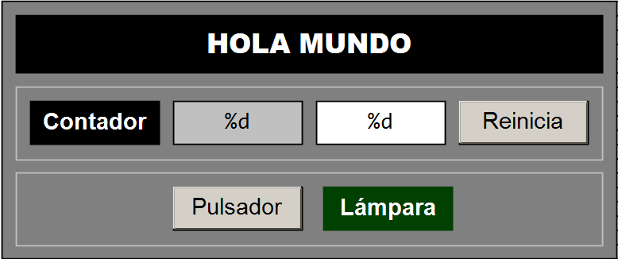

# 👋 Hola Mundo (TwinCAT 3)

## 📝 Descripción del Proyecto

Este proyecto es el **Hola Mundo** para **autómatas programables (PLC)**. 

Es un proyecto mínimo y funcional, que muestra la declaración y el uso básico de variables booleanas y enteras, ubicadas en los espacios de memoria de marcas, imagen de entrada e imagen de salida. Cubriendo los elementos esenciales de programación de los lenguajes de la norma **IEC 61131-3** para la programación de PLC.

<p align="center">
  
</p>

Este proyecto incluye además, una **visualización** elemental que permite interactuar con las variables del proyecto, con objetos gráficos. **Formas rectangulares** para mostrar el valor de variables booleanas y numéricas y **botones** para modificar el valor de variables booleanas y numéricas.

### 💻 Código

### Parte de declaración
```iecst
// Hola Mundo de la Programación de PLC
PROGRAM MAIN
VAR
    ContadorCiclos    : UINT;
    i_Pulsador AT %I* : BOOL;
    o_Lampara  AT %Q* : BOOL;
END_VAR
```
### Parte de implementación
```iecst
ContadorCiclos := ContadorCiclos + 1;
o_Lampara := i_Pulsador;
```

### 💬 Comentarios

- La variable `ContadorCiclos` se incrementa indefinidamente una vez por ciclo básico de ejecución del PLC (10 ms).
- La variable de salida `o_Lampara` copia, continuamente, el valor de la variable de entrada `i_Pulsador`
- El valor de la variable `ContadorCiclos` se muestra en la visualización.
- La variable `ContadorCiclos` puede reiniciarse si se acciona el pulsador `Reinicia`
- El valor de la variable `o_Lampara` se muestra con el cambio de color del rectángulo `Lampara` (verde claro = `false`, verde oscuro = `true`)
- El valor de la variable `i_Pulsador` cambia cuando se acciona el botón `Pulsador`

---

## 💻 Requisitos del Sistema

### Software

- **IDE:** Microsoft Visual Studio / TwinCAT 3 XAE (Versión mínima recomendada: **3.1.4024.x**).
- **Lenguajes:** Texto Estructurado (ST).
- **Target System:** Controlador Beckhoff, runtime local o UmRT_Default

---

## 🚀 Puesta en Marcha

Para descargar, compilar y ejecutar este proyecto en el entorno de TwinCAT 3, siga los siguientes pasos:

1. **Clonar Repositorio:**

```bash
    git clone https://github.com/vetorres-uma/TC3_Hola_Mundo.git
```

2. **Abrir el Proyecto:** abra el archivo `.sln` (Solución) ubicado en la carpeta principal utilizando el entorno de ingeniería **TwinCAT XAE** (integrado en Visual Studio).
1. **Selección del Controlador:** seleccione el simulador (**UmRT_Default**) o controlador local o remoto (**Choose Runtime System**).
1. **Activación de Configuración:** en el modo **Configuración**, active la configuración (**Activate Configuration**) y reinicie TwinCAT en modo Ejecución (**Run Mode**).
1. **Carga del Código:** en el entorno PLC, inicie la sesión y descargue el programa al PLC (**Login**).
1. **Poner el código en ejecución:** ejecute la lógica de control en el controlador **Start** (F5). Puede utilizar la visualización integrada en el proyecto PLC para facilitar la prueba.

---

## 🤝 Contribuciones

Este proyecto se utiliza con fines educativos y de prueba. Las contribuciones, sugerencias o correcciones de errores son bienvenidas. Por favor, abra un Issue o envíe un Pull Request si deseas contribuir.

---

## 🧑‍💻 Autor

- **Autor Principal:** Victor Torres [@vetorres-uma](<https://github.com/vetorres-uma>)
- **Revisor**: Angel Moreno [@famoreno](<https://github.com/famoreno>)
- **Revisor**: Manuel Castellano [@mcastellanoquero](<https://github.com/mcastellanoquero>)

---

## ⚖️ Licencia

Este proyecto es de código abierto y está disponible bajo la **Licencia Pública General GNU (GPL)**.

- Consulte el archivo `LICENSE.md` para más detalles.
  